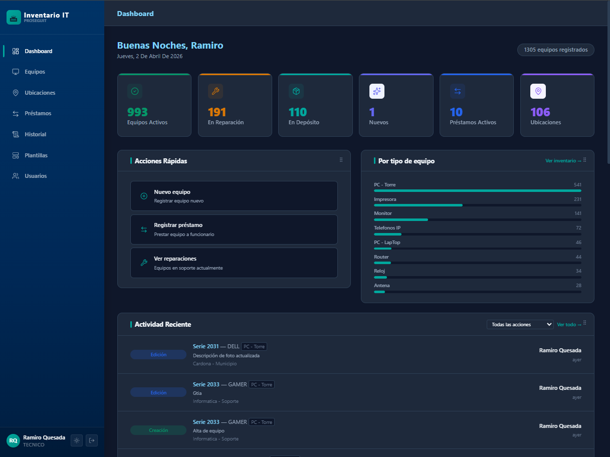
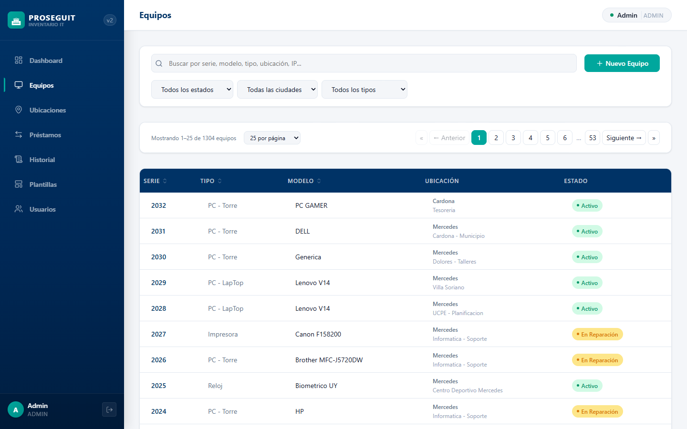
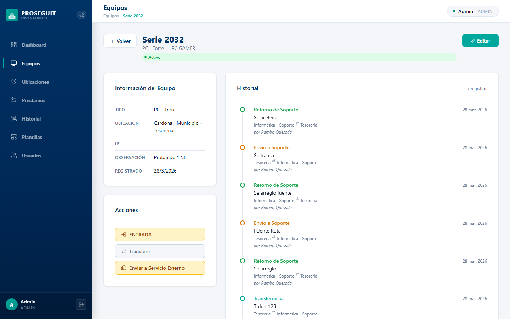
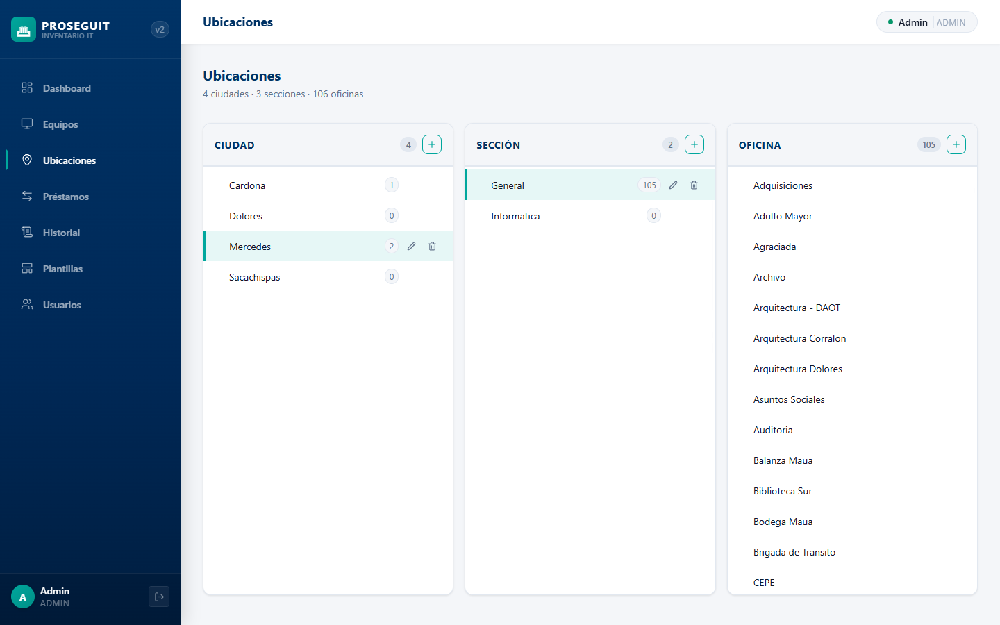
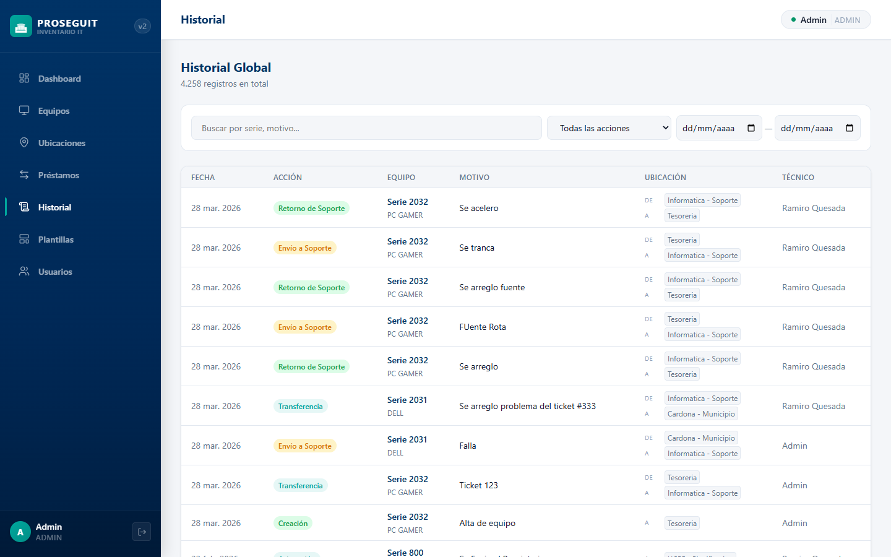
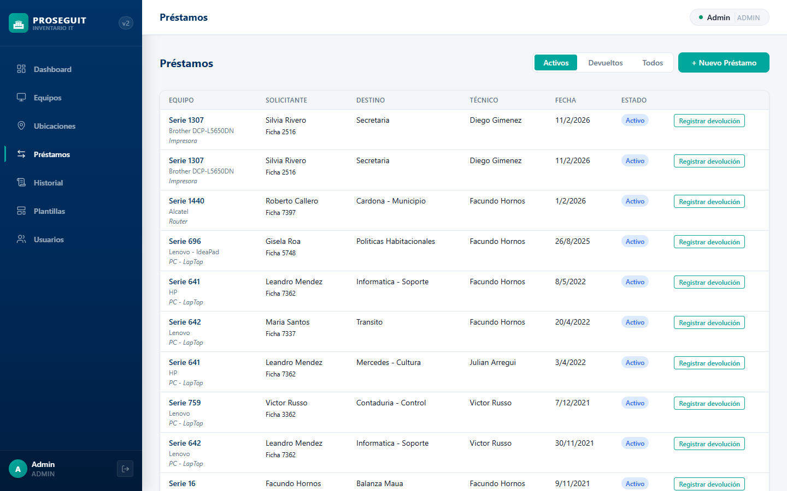

<div align="center">

# PROSEGUIT v2

**Sistema de Gestión de Inventario IT**
Intendencia Departamental de Soriano — Uruguay

[](https://nodejs.org/)
[](https://www.typescriptlang.org/)
[](https://react.dev/)
[](https://www.postgresql.org/)
[](https://expressjs.com/)
[](https://vitest.dev/)

</div>

---

> PROSEGUIT reemplaza al sistema heredado "seguit v1" (PHP/MySQL). Gestiona más de **2.000 equipos informáticos** distribuidos en más de **100 oficinas** de la Intendencia, con historial completo de movimientos, préstamos, envíos a servicio técnico y trazabilidad total de cada equipo.

---

## Capturas de pantalla

<details open>
<summary><strong>Dashboard</strong></summary>



*Resumen ejecutivo con contadores en tiempo real, saludo personalizado según hora del día y feed de actividad reciente con acceso directo a cada equipo.*

</details>

<details>
<summary><strong>Listado de equipos</strong></summary>



*Tabla completa con búsqueda debounced, filtros en cascada (ciudad → sección → oficina), chips de filtros activos, columnas ordenables y paginación configurable con selector arriba y abajo.*

</details>

<details>
<summary><strong>Ficha de equipo</strong></summary>



*Datos del equipo, estado derivado por ubicación, acciones disponibles (SALIDA / ENTRADA / baja / servicio externo) y timeline completo de historial.*

</details>

<details>
<summary><strong>Árbol de ubicaciones</strong></summary>



*Árbol jerárquico Ciudad → Sección → Oficina con CRUD inline y panel lateral que muestra los equipos de la oficina seleccionada.*

</details>

<details>
<summary><strong>Historial global</strong></summary>



*Registro de auditoría completo con filtros por tipo de acción y rango de fechas. Badges de color por tipo de acción, click en fila navega al equipo.*

</details>

<details>
<summary><strong>Préstamos</strong></summary>



*Registro de préstamos por número de serie y devolución con identificación del funcionario solicitante.*

</details>

---

## Características principales

| Módulo | Descripción |
|--------|-------------|
| **Inventario** | Búsqueda debounced, filtros en cascada, ordenamiento, paginación configurable |
| **Estado por ubicación** | El estado del equipo se deriva del nombre de la oficina — sin inconsistencias de DB |
| **Estado NUEVO** | Equipos recién ingresados quedan en NUEVO hasta ser asignados a una oficina final |
| **Historial de auditoría** | Toda acción registra motivo, técnico, ubicación origen/destino y timestamp |
| **Acciones de equipo** | Transferir (SALIDA), enviar a soporte (ENTRADA), servicio externo, baja |
| **Lógica de acciones** | El tipo de acción en SALIDA se determina automáticamente según el estado del equipo |
| **Préstamos** | Salida y devolución con identificación de funcionario y técnico responsable |
| **Ubicaciones** | Árbol 3 niveles (Ciudad › Sección › Oficina) con CRUD y panel de equipos |
| **Dashboard en tiempo real** | Contadores e historial se actualizan sin recargar la página tras cada acción |
| **Plantillas de modelo** | Especificaciones técnicas reutilizables en JSON |
| **Servicios externos** | Envío a reparación con proveedor, diagnóstico y fecha de retorno |
| **Usuarios y roles** | ADMIN / TECNICO, contraseñas temporales aleatorias, cambio forzado en primer login |
| **Auth JWT** | Access token (15 min) + refresh token (7 días) con **rotación automática** |
| **Seguridad** | Security headers (X-Frame-Options, CSP, etc.), rutas admin protegidas |

---

## Stack tecnológico

| Capa | Tecnología | Versión |
|------|-----------|---------|
| **Monorepo** | npm workspaces | — |
| **Backend** | Express + TypeScript | 5.2 / 5.9 |
| **ORM** | Prisma + adapter pg | 7.5 |
| **Base de datos** | PostgreSQL (Docker) | 17 |
| **Auth** | JWT + bcryptjs | — |
| **Validación** | Zod — compartido front/back via `@proseguit/shared` | 4.3 |
| **Frontend** | React + TypeScript + Vite | 19.2 / 5.9 / 8.0 |
| **Routing** | React Router | 7.13 |
| **Estado servidor** | TanStack Query | 5.94 |
| **UI** | CSS Modules + nesting nativo + custom properties | — |
| **Íconos** | Lucide React | — |
| **Tests** | Vitest (40 tests, sin DB) | 4.x |
| **Dev** | Docker Compose | — |

**Colores institucionales:** Teal `#00A79D` · Navy `#003366`

---

## Requisitos previos

- [Node.js](https://nodejs.org/) **v22 o superior**
- [Docker Desktop](https://www.docker.com/products/docker-desktop/) (para PostgreSQL)
- [Git](https://git-scm.com/)

---

## Desarrollo local

```bash
# 1. Clonar el repositorio
git clone https://github.com/ramiroquesada/PROSEGUIT.git
cd PROSEGUIT

# 2. Instalar todas las dependencias (backend + frontend + shared)
npm install

# 3. Levantar la base de datos
npm run db:up

# 4. Aplicar migraciones
npm run db:migrate

# 5. Cargar usuarios iniciales
npm run db:seed

# 6. Iniciar servidores de desarrollo
npm run dev
```

La aplicación estará disponible en:

| Servicio | URL |
|----------|-----|
| Frontend | http://localhost:5173 |
| Backend API | http://localhost:3001/api/v1 |

> El archivo `backend/.env` ya incluye los valores por defecto para desarrollo — no hace falta configurar nada extra.

---

## Comandos disponibles

```bash
# Desarrollo
npm run dev              # Backend (:3001) + Frontend (:5173) simultáneamente
npm run dev:backend      # Solo backend
npm run dev:frontend     # Solo frontend

# Tests (no requiere base de datos)
npm test                 # Corre los 40 tests del backend (Vitest)

# Base de datos
npm run db:up            # Levanta PostgreSQL en Docker (puerto 5433)
npm run db:down          # Detiene PostgreSQL
npm run db:migrate       # Aplica migraciones de Prisma
npm run db:studio        # Abre Prisma Studio (explorador visual)
npm run db:seed          # Crea usuarios admin (9999) y técnico (7844)
```

---

## Deploy en producción

Para levantar la aplicación en un servidor con Docker:

```bash
# 1. Copiar y completar las variables de entorno
cp .env.production.example .env.production
# Editar .env.production: POSTGRES_PASSWORD, JWT_SECRET, JWT_REFRESH_SECRET

# 2. Construir y levantar (PostgreSQL + backend + nginx)
docker compose -f docker-compose.prod.yml --env-file .env.production up -d --build

# 3. Cargar usuarios iniciales (solo la primera vez)
docker compose -f docker-compose.prod.yml exec backend npx tsx prisma/seed.ts
```

Las migraciones de base de datos se aplican automáticamente al iniciar. El frontend se sirve desde nginx en el puerto 80 y hace proxy de `/api` al backend.

---

## Estructura del proyecto

```
PROSEGUIT/
├── backend/
│   ├── Dockerfile                         # Imagen de producción (tsx)
│   ├── vitest.config.ts                   # Config de tests
│   ├── prisma/
│   │   ├── schema.prisma                  # Modelo de datos (12 modelos, 2 enums)
│   │   ├── seed.ts                        # Usuarios iniciales
│   │   ├── migrate-v1.ts                  # Migración desde seguit v1
│   │   └── migrations/
│   └── src/
│       ├── index.ts                       # Punto de entrada Express
│       ├── config/                        # env.ts
│       ├── middleware/                    # auth, validate, error-handler
│       └── modules/
│           ├── auth/                      # login, refresh, logout
│           ├── equipment/                 # CRUD + acciones + tests
│           ├── locations/                 # árbol Ciudad›Sección›Oficina
│           ├── history/                   # historial global
│           ├── loans/                     # préstamos
│           ├── model-templates/           # plantillas de modelo
│           ├── service-providers/         # proveedores de servicio
│           ├── users/                     # usuarios + tests
│           └── dashboard/                 # stats + actividad reciente
│
├── frontend/
│   ├── Dockerfile                         # Multi-stage: Vite build → nginx
│   ├── nginx.conf                         # Config nginx (proxy /api + SPA)
│   └── src/
│       ├── App.tsx                        # Router con code splitting (lazy)
│       ├── lib/
│       │   ├── api-client.ts              # Fetch con JWT auto-refresh
│       │   ├── auth-context.tsx           # AuthContext (React 19)
│       │   ├── equipment-status.ts        # resolveEstado() — estado por nombre de oficina
│       │   ├── action-types.ts            # Labels y colores de acciones centralizados
│       │   └── find-soporte-office.ts
│       ├── hooks/                         # useEquipment, useLocations, useHistory...
│       ├── components/
│       │   ├── layout/                    # Sidebar, Header, MainLayout
│       │   └── LocationCascadeSelect.tsx  # Selector Ciudad›Sección›Oficina reutilizable
│       ├── pages/                         # 12 páginas
│       └── styles/                        # variables.css, reset.css, globals.css
│
├── packages/shared/                       # Tipos, schemas Zod y constantes compartidas
├── docker-compose.yml                     # PostgreSQL para desarrollo
├── docker-compose.prod.yml                # Producción: postgres + backend + nginx
└── .env.production.example                # Template de variables de entorno para prod
```

---

## Modelo de datos

```
Ciudad ──< Seccion ──< Oficina ──< Equipo
                                      │
                           TipoEquipo ┤
                        ModeloTemplate┤
                                      │
                                  Historial (accion + motivo + origen + destino)
                                  Prestamo (solicitante + tecnico + fechas)
                                  EnvioServicio (ServicioExterno + diagnostico)
```

**Estados de equipo:** `NUEVO` · `ACTIVO` · `EN_REPARACION` · `EN_DEPOSITO` · `PRESTADO` · `EN_SERVICIO_EXTERNO`

**Tipos de acción:** `CREACION` · `ASIGNACION` · `EDICION` · `TRANSFERENCIA` · `ENVIO_SOPORTE` · `RETORNO_SOPORTE` · `PRESTAMO` · `DEVOLUCION` · `CAMBIO_ESTADO` · `ENVIO_SERVICIO_EXTERNO` · `RETORNO_SERVICIO_EXTERNO`

> El campo `estado` en la base de datos puede quedar desactualizado. Siempre se usa `resolveEstado(estado, oficina.nombre)` para mostrar el estado real en la UI.

---

## API REST

Base URL: `http://localhost:3001/api/v1`

Todos los endpoints requieren `Authorization: Bearer <token>` excepto `POST /auth/login`.

| Módulo | Endpoints |
|--------|-----------|
| **Auth** | `POST /auth/login` · `POST /auth/refresh` · `POST /auth/logout` |
| **Equipos** | `GET /equipment` · `POST /equipment` · `GET /equipment/:id` · `PUT /equipment/:id` |
| **Acciones equipo** | `POST /equipment/:id/transfer` · `/send-to-support` · `/send-to-service` · `/return-from-service` |
| **Tipos** | `GET /equipment/types` · `GET /equipment/next-serie` |
| **Ubicaciones** | `GET /locations/tree` · `POST /locations/cities` · `POST /locations/sections` · `POST /locations/offices` · `PUT` de cada uno |
| **Historial** | `GET /history` · `GET /history/equipment/:id` |
| **Préstamos** | `GET /loans` · `POST /loans` · `POST /loans/:id/return` |
| **Plantillas** | `GET/POST /model-templates` · `PUT/DELETE /model-templates/:id` |
| **Servicios** | `GET/POST /service-providers` · `PUT /service-providers/:id` |
| **Usuarios** | `GET/POST /users` · `PUT /users/:id` · `POST /users/:id/reset-password` · `POST /users/change-password` |
| **Dashboard** | `GET /dashboard/stats` · `GET /dashboard/recent-activity` |

---

## Migración desde seguit v1

Si se dispone de un dump SQL de seguit v1:

```bash
# 1. Colocar db_seguit1.sql en la raíz del proyecto

# 2. Extraer datos a JSON
node extract_data.js

# 3. Asegurarse de que la DB esté corriendo
npm run db:up

# 4. Ejecutar la migración
cd backend && npx tsx prisma/migrate-v1.ts
```

El script migra ubicaciones, tipos de equipo, usuarios, funcionarios, servicios externos, equipos, historial y préstamos. Ver `CLAUDE.md` para documentación completa del proceso.

---

## Credenciales de desarrollo

> ⚠️ Solo para entorno local. No usar en producción.

| Rol | Ficha | Contraseña |
|-----|-------|------------|
| ADMIN | `9999` | `admin123` |
| TECNICO | `7844` | `7844` |

Al crear nuevos usuarios en la app, el sistema genera una contraseña temporal aleatoria que se muestra una única vez. El usuario debe cambiarla en el primer login.

---

## Convenciones del proyecto

- **CSS**: Módulos CSS con nesting nativo y custom properties. Sin Tailwind, sin styled-components.
- **React 19**: `use(AuthContext)` en lugar de `useContext()`, `<Context value={}>` sin `.Provider`.
- **Estado de equipo**: nunca leer el campo `estado` directamente. Usar `resolveEstado(estado, oficina.nombre)`.
- **Mutaciones**: toda mutación de equipo debe invalidar `['equipment']`, `['history', 'equipment', id]` y `['dashboard']`.
- **Code splitting**: todas las páginas se cargan con `React.lazy`. Nuevas páginas deben seguir el mismo patrón.
- **Idioma UI**: Español (Uruguay) — "ficha", "técnico", "préstamo", "ubicación".

---

## Pendiente

- [ ] Responsive para mobile y tablet
- [ ] Subida de imágenes de equipos (campo `urlImage` ya existe en el schema)
- [ ] Migración con dump actualizado de seguit v1

---

<div align="center">

*Intendencia Departamental de Soriano — Departamento de Informática*

</div>
